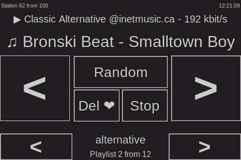
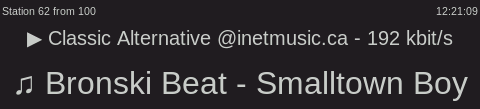

# Raspbdio

[На русском](README_ru.md)

Yet another simple internet radio for a single-board computer.

Tested with Raspberry Pi 2B with rasbbian bullseye, but will work on any computer with any linux distribution.

Origin of this repo: [gitlab.uscr.ru/raspbdio](https://gitlab.uscr.ru/public-projects/raspbdio)

* [Author](#author)
* [Installation](#installation)
    * [Installation of the Rasbdio](#software-installation)
    * [Manage playlists](#manage-playlists)
    * [Starting Rasbpdio](#starting-rasbpdio)
    * [How to hide mouse pointer for touchscreens (byllseyey or older)](#hide-mouse-pointer)
* [User manual](#user-manual)
    * [Application window overview](#raspbdio-screen-overview)
    * [Playlist controls](#playlist-controls)
    * [Station controls](#station-controls)
    * [Station information](#station-info)
* [Interface translation](#interface-translation)

## Author

Telegram [UsCr0](https://t.me/UsCr0)

## Installation

### Software installation

    ... clone this repo and cd to cloned directory ...

    sudo apt -y install python3-pip vlc
    sudo pip3 install -r requirements.txt
    mkdir -p ~/raspbdio/playlists
    cp ./* ~/raspbdio/
    sudo cp raspbdio.service /etc/systemd/system/raspbdio.service
    sudo sed -i "s/<USER>/$USER/g" /etc/systemd/system/raspbdio.service
    sudo systemctl daemon-reload
    sudo systemctl enable raspbdio.service

### Manage playlists

Add playlists in m3u format to ~/raspbdio/playlists.

You can find playlists, for example, in this github repository: [junguler/m3u-radio-music-playlists](https://github.com/junguler/m3u-radio-music-playlists)

### Starting Rasbpdio

    sudo systemctl start raspbdio.service

### Hide mouse pointer

    #Useful for raspbian byllseye or older
    sudo sed -i -- "s/#xserver-command=X/xserver-command=X -nocursor/" /etc/lightdm/lightdm.conf
    reboot

# User manual

## Raspbdio screen overview

Where is 3 lines:
* [Station information](#station-info)
* [Station controls](#station-controls)
* [Playlist controls](#playlist-controls)

### Station info

* "Classic Alternative @inetmusic.ca 192 kbit/s" is the current station name as it is written in the playlist file.
    * The symbol on the left side of the station name indicates the stream status. Raspbdio retrieves it from the VLC player instance:
        * ▶ means the stream is working fine.
        * ⌛ means "connecting".
        * ⚠ is for any other status (such as "Error").
* "Bronsky Beat - Smalltown Boy" is the song name from the station's metadata.
    * Not every station allows reading metadata, so the song name may not be available for different stations.

### Station controls

* Buttons < and > allow you to select a station from the current playlist.
* Use the "Random" button to play a random station from the current playlist.
    * If the randomly selected station has any problems with the stream, Rasbpdio will automatically retry the random choice until a working station is found.
* The "Stop" button is for stopping the current station stream.
* ❤️ Adding a station to the "Favorites" playlist.
    * On the screenshot button label is "Del ❤️" because station is already in favorites
    * The "Favorites" playlist is called "Favorites.m3u". It will always be the first playlist.

### Playlist controls

* Buttons < and > allows you to select a playlist from `~/raspbdio/playlists` directory.
    * Favorites playlist is always be the first playlist
    * Playlist with favorites station keeps on disk as regular playlist, but changed dynamically

# Interface Translation
By default, the interface is in Russian.
To translate the interface, simply change the values of variables at the beginning of raspbdio.py and Rasbpdio.py:

    # raspbdio.py
    stop_button_label = "Стоп"
    random_button_label = "Случайная"
    favorite_button_label = "❤"
    delete_favorite_button_label = "Убрать\n❤"
    station_word = "Станция"
    from_word = "из"
    playlist_word = "Плейлист"

    #Raspbdio.py
    favorites_name = "Избранное"
    empty_playlist_message = "Плейлист пуст"
    parse_playlist_error_message = "Ошибка чтения плейлиста"
    parse_station_name_error_message = "Ошибка получения имени станции"

For example, for translation into English:

    # raspbdio.py
    stop_button_label = "Stop"
    random_button_label = "Random"
    favorite_button_label = "❤"
    delete_favorite_button_label = "Del ❤"
    station_word = "Station"
    from_word = "from"
    playlist_word = "Playlist"

    #Raspbdio.py
    favorites_name = "Favorites"
    empty_playlist_message = "Playlist is empty"
    parse_playlist_error_message = "Playlist parsing error"
    parse_station_name_error_message = "Station name parsing error"