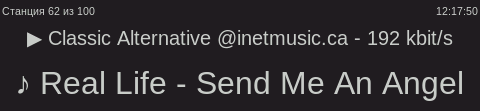

# Raspbdio

[In English](README.md)

Очередное интернет-радио для одноплатника.

Тестировалось на Raspberry Pi 2B под rasbbian bullseye, но должно работать на любом linux компьютере.

Свежайшие коммиты в этот репозиторий тут: [gitlab.uscr.ru/raspbdio](https://gitlab.uscr.ru/public-projects/raspbdio)

* [Контакты автора](#контакты)
* [Установка](#установка)
    * [Установка Rasbdio](#установка-софта)
    * [Добавление плейлистов](#управление-плейлистами)
    * [Запуск Rasbpdio](#запуск-rasbpdio)
    * [Как скрыть указатель мыши (byllseyey или старше)](#скрытие-указателя-мыши)
* [Инструкция пользователя](#инструкция)
    * [Главный икран](#обзор-главного-экрана)
    * [Информация о станции](#информация-о-станции)
    * [Управление станцией](#управление-станцией)
    * [Управление плейлистом](#управление-плейлистом)
* [Перевод интерфейса на другие языки](#перевод-интерфейса)

## Контакты

Telegram [UsCr0](https://t.me/UsCr0)

## Установка

### Установка софта

    ... склонируйте репозиторий и перейдите к каталог репозитория ...

    sudo apt -y install python3-pip vlc
    sudo pip3 install -r requirements.txt
    mkdir -p ~/raspbdio/playlists
    cp ./* ~/raspbdio/
    sudo cp raspbdio.service /etc/systemd/system/raspbdio.service
    sudo sed -i "s/<USER>/$USER/g" /etc/systemd/system/raspbdio.service
    sudo systemctl daemon-reload
    sudo systemctl enable raspbdio.service

### Управление плейлистами

Плейлисты в формате m3u нужно положить в ~/raspbdio/playlists.

YПодборка плейлистов есть в этом репозитории: [junguler/m3u-radio-music-playlists](https://github.com/junguler/m3u-radio-music-playlists)

### Запуск Rasbpdio

    sudo systemctl start raspbdio.service

### Скрытие указателя мыши

    #Работает в raspbian byllseye или более старых
    sudo sed -i -- "s/#xserver-command=X/xserver-command=X -nocursor/" /etc/lightdm/lightdm.conf
    reboot

# Инструкция

## Обзор главного экрана

Интерфейс разделён на 3 линии (блока):
* [Информация о станции](#информация-о-станции)
* [Управление станцией](#управление-станцией)
* [Управление плейлистом](#управление-плейлистом)

### Информация о станции

* "Classic Alternative @inetmusic.ca 192 kbit/s" это название выбранной станции, так, как оно указано в файле плейлиста.
    * Символ слева от названия станции отображает состояние потока. Эту информацию приложение получает от VLC плеера:
        * ▶ поток работает номально
        * ⌛ ожидаем получения потока
        * ⚠ для всех остальных статусов (в том числе для ошибки потока)
* "Real Life - Send me an angel" название трека который сейчас звучит. Получен из метадаты потока
    * Не все станции отдают метаданные. Название композиции может отображаться не для всех станций

### Управление станцией

* Кнопки < и > позволяют выбрать станцию в текущем плейлисте
* Кнопка "Случайная" выбирает случайную станцию из плейлиста
    * Если выбранная случайно станция недоступна (поток "битый"), приложение будет снова и снова выбирать случайную станцию пока не найдёт рабочую
* Кнопка "Стоп" останавливает/возобновляет воспроизведение потока
* ❤️ позволяет добавить станцию в Избранное.
    * На скриншоте кнопка называется "Удалить ❤️" потому, что станция уже добавлена в избранное
    * Избранное попадает в отдельный плейлист "Избранное.m3u". Он всегда будет первым в списке плейлистов

### Управление плейлистом

* Кнопки < и > позволяют выбрать плейлист из каталога `~/raspbdio/playlists`
    * Плейлист с избранным всегда будет первым в списке плейлистов
    * Плейлист с избранными станциями хранится на диске как обычый плейлист, но обновляется динамически

# Перевод интерфейса
По умолчанию, интерфейс на русском языке.
Для перевода интерфейса достаточно изменить значения переменных в начале raspbdio.py и Rasbpdio.py:

    # raspbdio.py
    stop_button_label = "Стоп"
    random_button_label = "Случайная"
    favorite_button_label = "❤"
    delete_favorite_button_label = "Убрать\n❤"
    station_word = "Станция"
    from_word = "из"
    playlist_word = "Плейлист"

    #Raspbdio.py
    favorites_name = "Избранное"
    empty_playlist_message = "Плейлист пуст"
    parse_playlist_error_message = "Ошибка чтения плейлиста"
    parse_station_name_error_message = "Ошибка получения имени станции"

Например, для перевода на английский:

    # raspbdio.py
    stop_button_label = "Stop"
    random_button_label = "Random"
    favorite_button_label = "❤"
    delete_favorite_button_label = "Del ❤"
    station_word = "Station"
    from_word = "from"
    playlist_word = "Playlist"

    #Raspbdio.py
    favorites_name = "Favorites"
    empty_playlist_message = "Playlist is empty"
    parse_playlist_error_message = "Playlist parsing error"
    parse_station_name_error_message = "Station name parsing error"